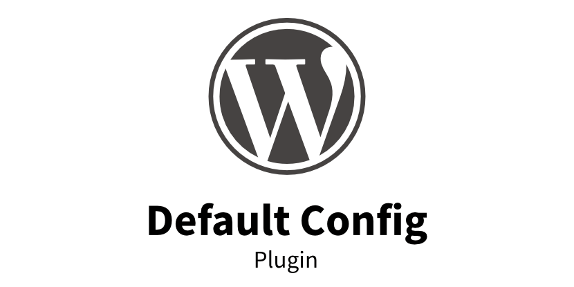

# WordPress Security & Performance

- [About](#about)
- [Features](#features)
- [How to use](#how-to-use)
- [Credits](#credits)

 

---

  

## About

Only use if you know what you need. WordPress plugin with some hardcoded, opinionated defaults for enhanced security and reduced feature set. Generic and theme-independent implementation with a modern code style.

**Intended for developers – Not end users**

_Due to use of many 3rd party sources, this plugin is not official. Take what you need or use the setup as boilerplate for your own plugins._

  

## Features

Some features are **breaking changes** and limit functinality of plugins.
Unneeded features can be disabled in code.

### Security

- Disable XMLRPC API (breaks mobile app use!)
- Disallow login via email address (use user name instead)
- Disable oEmbed
- Remove login error message
- Remove meta tags and version numbers
- Remove links + HTML from posted comments (anti-spam)

### Performance

- Disable Emoji font and styles (can still be used via Unicode)
- Remove unused links from `<head>` (e.g. feeds)
- Move all loaded scripts to document end (remove from head)

### General

- Disable redundant self ping (reduce server load)
- Delay post publication via RSS (ideal for last-minute QA and fixes)
- Set image quality to 100% (use plugins for compression)

### Developer

- Clean and modern OOP style

  

## How to use

Copy the folder content in your WordPress installation.

#### Features

All features are loaded modular and can be edited here:

- `/wp-content/plugins/codeconut-global/app/class.php`

#### Git workflow

Use of submodules is recommended:

`git submodule add USER:REPOSITORY wp-content/plugins/codeconut-global`

Call this from web root. The path must not be preceded with a slash.

  

## Credits

This plugin combines a few great public resources into one package.

### Authors

Andreas Hecht

- https://www.drweb.de/wordpress-snippets

Cloudflare

- https://blog.cloudflare.com/wordpress-pingback-attacks-and-our-waf
- https://blog.cloudflare.com/a-look-at-the-new-wordpress-brute-force-amplification-attack

WpBeginner

- https://www.wpbeginner.com/beginners-guide/vital-tips-and-tools-to-combat-comment-spam-in-wordpress
- https://www.wpbeginner.com/wp-tutorials/25-extremely-useful-tricks-for-the-wordpress-functions-file
